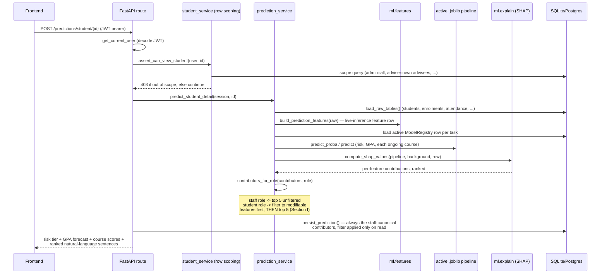
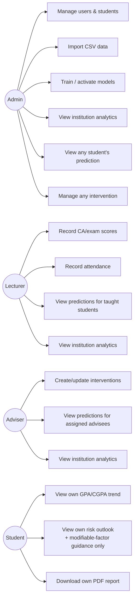

# Architecture

## 1. System overview

The Student Performance Prediction System is an offline-first web application
that predicts three things for a university student's current semester, from
a trained scikit-learn/XGBoost pipeline rather than a rule of thumb:

1. **Risk classification** — probability the student's semester GPA falls
   below the probation threshold, bucketed into four tiers (low / moderate /
   high / critical).
2. **GPA regression** — a point forecast for the semester GPA and projected
   CGPA, with a prediction interval.
3. **Course-score regression** — a per-course score forecast for each
   ongoing enrolment, from CA and attendance only (Section G, T3).

It is built as two deployables that run on one machine with no internet
access at runtime: a FastAPI backend serving JSON over `/api/v1` and static
PDFs, and a React/Vite frontend consuming that API. SQLite is the default
database (one file, zero setup); switching to PostgreSQL is a single
`DATABASE_URL` environment variable, nothing else changes.

## 2. Technology stack

| Layer | Choice | Why |
|---|---|---|
| Backend framework | FastAPI + Uvicorn | async-capable, typed request/response models, free interactive docs at `/docs` |
| ORM / validation | SQLModel (SQLAlchemy + Pydantic v2) | one class defines the DB table *and* the API schema base, so the two can't drift silently |
| Auth | python-jose (JWT) + passlib/bcrypt | stateless bearer tokens; no session store to run alongside SQLite |
| Migrations | Alembic | schema changes are versioned, not "just re-run create_all" |
| ML | scikit-learn, XGBoost, imbalanced-learn (SMOTE), SHAP | six comparable algorithms behind one `Pipeline` interface; SHAP explains all of them uniformly (see §5) |
| Reports | reportlab | server-side PDF generation, no headless-browser dependency |
| Frontend | React 18 + Vite + TypeScript (strict) | fast dev server, typed components |
| Data fetching | TanStack Query | request caching/retry/loading-state plumbing so every page can have a real skeleton/empty/error state (Section I) without hand-rolled `useEffect` chains |
| Styling | Tailwind CSS | design-token-driven utility classes matching the locked navy/amber/risk-tier palette |
| Charts | Recharts | the only charting dependency; renders entirely client-side from live API data |
| Testing | pytest + pytest-cov + httpx (backend), vitest + React Testing Library (frontend) | see `docs/user-manual.md` §Testing and the coverage figures in `docs/known-issues.md`'s sibling — the root README |

Nothing above talks to a network service at runtime: SHAP, scikit-learn,
reportlab, and the frontend's own bundled assets all run locally. Google
Fonts, CDNs, and hosted ML APIs are deliberately absent (Section C).

## 3. Directory structure

```
backend/
  app/
    main.py            FastAPI app, CORS, router mount
    core/               config.py, academic_config.py (single source of truth
                         for grade bands/GPA scale/probation threshold), security.py
                         (JWT + bcrypt), deps.py (coarse role dependencies)
    models/             SQLModel tables — one file per entity (§4)
    schemas/            Pydantic request/response models, one file per resource
    api/v1/              one router per resource; role dependencies attached
                         per-route, row-level scoping delegated to services/
    services/            business logic: row-scoping, score computation,
                         prediction serving, PDF generation
    db/                  session factory, seed loader, CSV importer
  ml/
    config.py            feature lists, hyperparameter grids, leakage-guard
                          constants, USE_PROTECTED_ATTRIBUTES flag
    data_generator.py    causally-coherent synthetic dataset (§6)
    features.py           feature engineering + assert_no_leakage (§6)
    preprocessing.py      shared impute/scale/encode pipeline, fit-on-train only
    train.py               GridSearchCV over all six algorithms x three tasks
    evaluate.py            metrics + 300dpi chart export
    explain.py             model-agnostic SHAP wrapper + natural-language templates
    fairness.py             demographic-parity/equal-opportunity/predictive-parity audit
    artifacts/               trained .joblib pipelines + metrics JSON (gitignored)
  tests/                    pytest suite, one file per ml/ or services/ module
frontend/
  src/
    pages/                one file per route, grouped by resource
    components/            layout chrome, role-gated auth wrapper, reusable UI atoms
    contexts/, hooks/        AuthContext, useDebouncedValue, etc.
    lib/                    typed API client, CSV parsing, blob-download helper
    types/                  TypeScript mirrors of the Pydantic schemas
docs/                        this file, api.md, user-manual.md, installation.md,
                              demo-script.md, diagrams/ (training charts)
```

## 4. Data model (ERD)

Every table gets `id`, `created_at`, `updated_at` from a shared
`TimestampedModel` base (omitted below for readability). Enum-typed columns
store their string *value* (`"admin"`, not `"ADMIN"`) via a `db_enum()`
helper, matching the API contract and seed data exactly.

```mermaid
erDiagram
    USERS ||--o{ STUDENTS : "advises (adviser_id)"
    USERS ||--o{ COURSES : "teaches (lecturer_id)"
    USERS ||--o{ INTERVENTIONS : "creates (created_by)"
    USERS ||--o| STUDENTS : "is (student_id, for role=student)"
    STUDENTS ||--o{ ENROLMENTS : registers
    STUDENTS ||--o{ ACADEMIC_HISTORY : "has per-semester"
    STUDENTS ||--o{ ENGAGEMENT : "has per-semester"
    STUDENTS ||--o{ PREDICTIONS : "predicted for"
    STUDENTS ||--o{ INTERVENTIONS : "receives"
    COURSES ||--o{ ENROLMENTS : "enrolled in"
    ENROLMENTS ||--o| ATTENDANCE : "tracks"
    PREDICTIONS ||--o{ INTERVENTIONS : "may prompt"
    MODEL_REGISTRY }o--|| PREDICTIONS : "version served by"

    USERS {
        int id PK
        string email UK
        string password_hash
        string full_name
        enum role "admin|lecturer|adviser|student"
        int student_id FK "nullable"
        bool is_active
    }
    STUDENTS {
        int id PK
        string matric_no UK
        string first_name
        string last_name
        enum gender
        date date_of_birth
        string department
        string programme
        int level "100-500"
        string entry_mode
        float entry_score
        string state_of_origin
        enum accommodation
        bool has_scholarship
        enum employment_status
        int adviser_id FK
        string enrolment_session
        bool is_active
    }
    COURSES {
        int id PK
        string course_code UK
        string title
        int credit_units
        int level
        string semester
        string department
        int lecturer_id FK
        bool is_core
    }
    ENROLMENTS {
        int id PK
        int student_id FK
        int course_id FK
        string session
        string semester
        float ca_score
        float exam_score
        float total_score
        string grade
        int grade_point
        enum status "ongoing|completed|withdrawn"
        bool is_carryover
    }
    ATTENDANCE {
        int id PK
        int enrolment_id FK UK
        int sessions_held
        int sessions_attended
        float attendance_rate "derived"
    }
    ENGAGEMENT {
        int id PK
        int student_id FK
        string session
        string semester
        int assignments_submitted
        int assignments_total
        float submission_punctuality_rate
        int lms_logins
        int library_visits
        float study_hours_per_week
        float tutorial_attendance
    }
    ACADEMIC_HISTORY {
        int id PK
        int student_id FK
        string session
        string semester
        int credits_registered
        int credits_earned
        float gpa
        float cgpa
        enum standing "good|warning|probation|withdrawal"
    }
    PREDICTIONS {
        int id PK
        int student_id FK
        string model_version
        enum task "risk_classification|gpa_regression|course_score"
        float predicted_value
        string predicted_class
        enum risk_tier
        float confidence
        float probability
        json feature_contributions
        json input_snapshot
        datetime predicted_at
    }
    INTERVENTIONS {
        int id PK
        int student_id FK
        int prediction_id FK "nullable"
        int created_by FK
        enum action_type
        string notes
        enum status "planned|in_progress|completed|cancelled"
        string outcome_note
        datetime resolved_at
    }
    MODEL_REGISTRY {
        int id PK
        string version UK "task__algorithm"
        enum task
        string algorithm
        datetime trained_at
        int training_rows
        json feature_list
        json hyperparameters
        json metrics
        json fairness_report
        string artifact_path
        bool is_active
    }
    AUDIT_LOG {
        int id PK
        int user_id FK "nullable"
        string action
        string entity
        int entity_id
        json detail
        datetime timestamp
    }
```

## 5. Prediction request data flow

A single-student prediction (`POST /predictions/student/{id}`) touches every
layer of the system, which makes it the clearest example of how the pieces
fit together:



Two things about this path are load-bearing for the project's grading
criteria, not incidental:

- **The leakage guard runs inside `build_prediction_features`/
  `build_semester_features`.** `assert_no_leakage` raises if a
  target-semester outcome column (`exam_score`, `total_score`, `grade`,
  `grade_point` for the semester or course being predicted) ever reaches the
  feature matrix. It is called from the training pipeline and covered by a
  test that injects a banned column and asserts the raise (Section G).
- **The Section I student filter is enforced in `prediction_service.
  contributors_for_role`, not in the frontend.** A student role gets
  `filter_to_modifiable_contributors` applied before the top-5 truncation
  (not after — truncating to staff's top 5 first would silently drop
  modifiable factors ranked 6th-10th), and `render_student_sentences`
  produces forward-looking language ("Improving your attendance to 80%
  would help going forward") instead of a bare risk verdict. Bypassing the
  UI (calling the API directly as a student, or editing the page's
  JavaScript) cannot expose the filtered-out factors, because the server
  never sends them in the first place.

## 6. Key design decisions

**Protected attributes excluded from model features by default.**
`gender`, `state_of_origin`, and `date_of_birth` are collected (they're
needed for the fairness audit's group-by variable) but never enter the
feature matrix — `ml/config.py`'s `USE_PROTECTED_ATTRIBUTES = False` is
checked in `ml/features.py` before any column is added. Fairness is
evaluated against them anyway, on a held-out temporal split, and any group
disparity above 10 percentage points is flagged in `model_registry.
fairness_report` (Section G).

**A causally-coherent synthetic generator, not random noise.**
`ml/data_generator.py` encodes real correlations (attendance ↔ CA score ≈
0.55, prior CGPA ↔ next-semester GPA ≈ 0.65, full-time employment depressing
study hours) and injects 4-8% missingness into attendance/engagement columns
specifically, so the preprocessing pipeline's imputation is exercised
against a realistic pattern rather than a clean table. The seed is recorded
for reproducibility.

**Model-agnostic SHAP, one explainer path for all six algorithms.**
`ml/explain.py` wraps each trained pipeline's own `predict`/`predict_proba`
rather than special-casing `TreeExplainer` for tree models and
`KernelExplainer` for everything else. This costs more compute per
explanation (a few seconds) but means every algorithm — including the MLP,
which has no fast tree-structure shortcut — is explained through the exact
same code path, so a change of active model never silently loses
explainability.

**Row-level scoping lives in the service layer, not the route.**
`app.core.deps` only answers "is this role even allowed to hit this
endpoint" (a lecturer can't call `POST /interventions` at all). Which
*specific* rows a lecturer, adviser, or student may see is computed once, in
`student_service.scope_student_ids`, and reused by every service that needs
it (interventions, analytics, batch prediction) — so the scoping rule for
"a lecturer sees students in courses they teach" exists in exactly one
place.

**Every prediction is real inference, always.** There is no code path,
demo mode, or fallback that returns a hand-written number for a prediction
value. If the active model artifact can't be loaded, the endpoint raises
rather than returning something plausible-looking (Section C, Section K).

## 7. Use-case overview



Every arrow above is enforced twice: a coarse role check at the route
(`app.core.deps`), and row-level scoping in the service layer
(`student_service.scope_student_ids` and friends) — see §6. `docs/api.md`
lists the exact role requirement per endpoint; `tests/test_api_roles.py`
asserts a 403 for one forbidden case per role.
